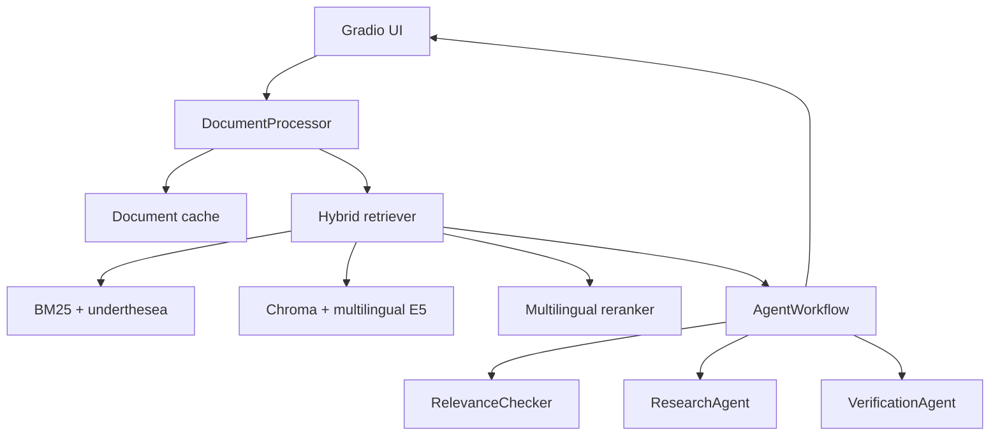

# DocuMind AI

DocuMind AI is a multilingual document question-answering app for Vietnamese and English files. It combines lightweight document parsing, hybrid retrieval, local multilingual embeddings, Grok-powered agents, answer verification, and source citations.

## Features

- Upload PDF, DOCX, TXT, and Markdown documents.
- Ask questions in Vietnamese or English.
- Retrieve evidence with Vietnamese-aware BM25 plus multilingual semantic search.
- Persist Chroma indexes by file hash to avoid repeated embeddings.
- Generate grounded answers with a bounded multi-agent flow: relevance, research, verification.
- Show source chunks with filename, page, section, and excerpt.
- Run offline unit tests without a live xAI key.

## Architecture



## Quick Start

```bash
python -m venv .venv
.venv\Scripts\activate
pip install -r requirements.txt
copy .env.example .env
python app.py
```

Set `XAI_API_KEY` in `.env` before running live Grok requests.

## Configuration

Important environment variables:

- `XAI_API_KEY`: required for live model calls.
- `RELEVANCE_MODEL`: default `grok-3-mini-fast`.
- `RESEARCH_MODEL`: default `grok-3`.
- `VERIFICATION_MODEL`: default `grok-3-mini`.
- `EMBEDDING_MODEL`: default `intfloat/multilingual-e5-small`.
- `SERVER_HOST`: default `0.0.0.0`.
- `SERVER_PORT`: default `7860`.

## Tests

```bash
python -m pytest tests -q
```

The current test suite uses injected clients and test doubles for external model boundaries, so it does not contact xAI or download embedding/reranker models.

## Docker

```bash
docker compose up --build
```

The compose file mounts `document_cache/` and `chroma_db/` so document and embedding caches survive container restarts.

## Evaluation

RAGAS evaluation is prepared but **not yet run**. The JSON files in `eval/` provide seed question/answer pairs; replace or extend them with ground truth from your real evaluation documents before publishing metrics.

To run evaluation after you have generated answers and contexts:

```bash
pip install ragas datasets
python eval/run_ragas_eval.py --input eval/results.json
```

Do not publish RAGAS scores until they come from an actual run with real inputs and configured model access.

## HuggingFace Spaces

This repository is compatible with a Gradio Space. Configure these secrets in the Space settings:

- `XAI_API_KEY`
- Optional model and retrieval overrides from `.env.example`

Use `app.py` as the Space entrypoint. A hosted deployment has **not yet run** from this repository.

## Limitations

- Scanned PDFs need OCR before this app can retrieve meaningful text.
- Legacy Vietnamese PDF encodings can extract poorly if the PDF does not contain Unicode text.
- First retrieval run downloads local embedding/reranker models and can take longer than cached runs.
